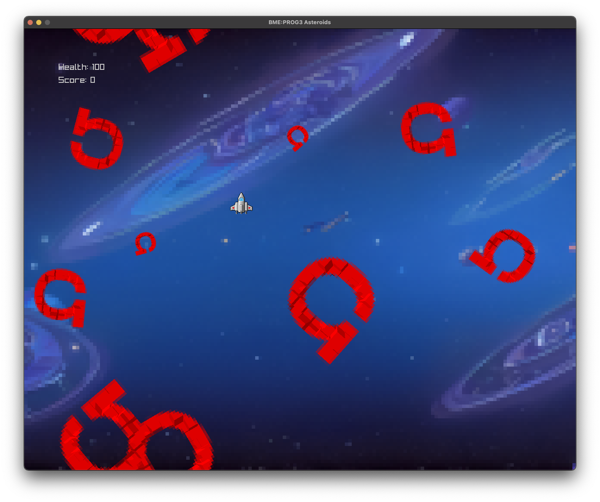

# PROG3 Lab 02

Autor: Prof. Dr.-Ing. Enrico Schröder, OHM Technische Hochschule Nürnberg, Fakultät EFI

**Willkommen zur zweiten Übung zur Veranstaltung PROG3 / Teil B!**

# Übersicht

In dieser Übung werden wir unser Spiel entscheidend erweitern. Wir werden uns eine genauere Klassenstruktur überlegen
und diese implementieren. Ziel ist es, am Ende einen ersten spielbaren Prototypen zu haben!

Sie können mit Ihrem Code aus der letzten Übung weiterarbeiten oder den Code aus diesem Repository als Grundlage nehmen.

Arbeiten Sie dieses Dokument bitte von oben nach unten komplett ab! Lesen Sie die einzelnen Abschnitte zuerst komplett
durch, bevor Sie loslegen!

# Aufgabe 01

**Modellieren Sie eine genauere Klassenstruktur für Ihr Spiel.**

Sie haben sich in der letzten Übung bereits erste Gedanken gemacht, wie eine sinnvolle Klassenstruktur für Ihr Spiel
aussehen könnte. Machen Sie sich nun genauere Gedanken, welche Elemente Sie in Ihrem Spiel benötigen werden und wie
diese zusammenhängen. Nutzen Sie Vererbung bzw. Ableitung! Modellieren Sie Ihre Struktur als UML-Diagramm (inklusive
öffentlicher Methoden sowie Member-Variablen). Sie können das entweder mittels eines geeigneten Programms machen oder
auf einem Blatt Papier.

Stellen Sie sich für Ihre Klassenstruktur insbesondere folgende Fragen:

- Was haben alle Ihre Objekte im Spiel (z.B. das Raumschiff, Asteroiden und Projektile) gemeinsam? All das sollte in
  eine geeignete Elternklasse (z.B. namens `GameObject`) ausgelagert werden.
- Wer kümmert sich um die Verwaltung aller Objekte sowie um Ihre Spiellogik?

Fügen Sie Ihrem Protokoll das UML-Diagramm hinzu und erläutern Sie es kurz (was machen die einzelnen Klassen und wie
hängen sie zusammen?)!

# Aufgabe 02

**Implementieren Sie Ihre Klassenstruktur in C++.**

Nutzen Sie das UML-Diagramm aus Aufgabe 01 und implementieren es in C++. Modifizieren Sie ggf. Ihren bestehenden Code
bzw. den Code aus diesem Repository, sodass er zum UML-Diagramm passt.

Ziel ist es, am Ende folgende Funktionalität zu haben:

- Ein vom Spieler steuerbares Raumschiff, das Projektile verschießen kann (noch ohne korrekte Bewegungsphysik, d.h. Sie
  können einfach die Position direkt mittels Tastatureingaben verändern).
- Umherfliegende Asteroiden.
- Grundlegende Spiellogik (Lebensenergie des Raumschiffs, Punkte). Hinweis: Die Spiellogik muss nur vorbereitet, aber
  nicht vollständig implementiert sein (dafür benötigen wir Kollisionen, um die wir uns später kümmern).

Sie werden zwangsläufig an irgendeiner Stelle sämtliche Spielobjekte in einer Liste verwalten müssen. Ziel ist es, dass
sie nur eine einzelne Liste haben, in der Sie alle Objekte verwalten (z.B. einen std::vector<GameObject*>). Sie sollten
nicht für jede Objektart (Asteroiden, Projektile etc.) eine eigene Liste haben!

Fügen Sie den Code ihrem Protokoll hinzu! Falls Sie bei der Implementierung festellen, dass Sie Änderungen an Ihrer
Klassenstruktur bzw. am UML-Diagramm benötigen, beschreiben Sie diese im Protokoll.

# Aufgabe 03 (Bonusaufgabe)

**Erweitern Sie Ihr Spiel um Kollisionsabfrage.**

Überlegen Sie, wie Sie Kollisionen in Ihrem Spiel berücksichtigen können. Welche Objektarten können miteinander
kollidieren und was passiert bei einer Kollision? Wo in Ihrem Code wollen Sie die Kollisionen behandeln? Schreiben Sie
Ihre Antworten ins Protokoll!

Implementieren Sie nun die Kollisionsabfrage. Stoßen Sie dabei auf Probleme, die sich nur umständlich (d.h. durch viel
Code) lösen lassen? Wenn ja, beschreiben Sie die Probleme im Protokoll und überlegen, wie sich die Implementierung
eventuell vereinfachen ließe.

--------------

### Art Credit

Spaceship: opengameart.org, License Creative Commons 0 - Public Domain,
Bullets: opengameart.org, License Creative Commons 4 - (c) @janachumi,
Background: generated with Adobe Firefly,
Ohmsteroid: License Creative Commons 4 - (c) E.Schröder